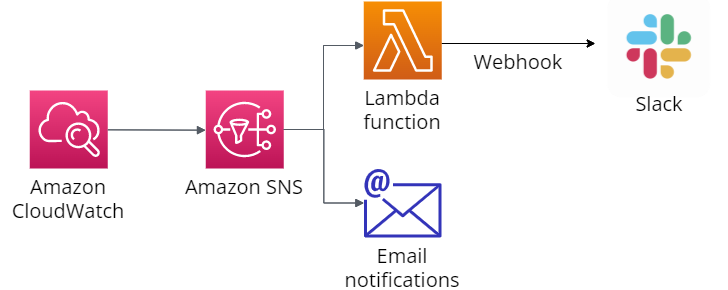

# terraform-sns-notify

This module creates an SNS topic, adds two subscriptions to it (Email and Lambda) and a cloudwatch alarm to publish to the topic

## Features:
1- Creates an amazon SNS Topic
2- adds en email subscription
3- Creates a lambda function to post to a slack webhook.
4- Creates a Cloudwatch alarm to publish to the SNS topic.

## Architecture:



## Usage

To post messages to Slack, you should create a Slack app and create an Incoming webhook to enable the lambda function to send an http request to it.
Specify the endpoint in the `slack_endpoint` variable.

Add a list of emails for the SNS subscription.

to test the Cloudwatch alarm, run the following command:

```shell
$ cloudwatch set-alarm-state --alarm-name <value> --state-value <value> --state-reason <value>
```

`--alarm-name` (string)

The name of the Alarm

`--state-value` (string)

value of the state. Possible values:

- `OK`

- `ALARM`

- `INSUFFICIENT_DATA`

`--state-reason` (string)

The reason that triggered the alarm

navigate to the `example` directory then:

```shell
$ terraform init 
```

```shell
$ terraform plan 
```

```shell
$ terraform apply 
```

<!-- BEGIN_TF_DOCS -->
## Requirements

| Name | Version |
|------|---------|
| <a name="requirement_archive"></a> [archive](#requirement\_archive) | ~> 2.2.0 |

## Providers

| Name | Version |
|------|---------|
| <a name="provider_archive"></a> [archive](#provider\_archive) | ~> 2.2.0 |
| <a name="provider_aws"></a> [aws](#provider\_aws) | n/a |

## Modules

No modules.

## Resources

| Name | Type |
|------|------|
| [aws_cloudwatch_metric_alarm.this](https://registry.terraform.io/providers/hashicorp/aws/latest/docs/resources/cloudwatch_metric_alarm) | resource |
| [aws_iam_role.lambda_exec](https://registry.terraform.io/providers/hashicorp/aws/latest/docs/resources/iam_role) | resource |
| [aws_iam_role_policy_attachment.this](https://registry.terraform.io/providers/hashicorp/aws/latest/docs/resources/iam_role_policy_attachment) | resource |
| [aws_lambda_function.lambda_webhook](https://registry.terraform.io/providers/hashicorp/aws/latest/docs/resources/lambda_function) | resource |
| [aws_lambda_permission.this](https://registry.terraform.io/providers/hashicorp/aws/latest/docs/resources/lambda_permission) | resource |
| [aws_sns_topic.sns_notify](https://registry.terraform.io/providers/hashicorp/aws/latest/docs/resources/sns_topic) | resource |
| [aws_sns_topic_subscription.email](https://registry.terraform.io/providers/hashicorp/aws/latest/docs/resources/sns_topic_subscription) | resource |
| [aws_sns_topic_subscription.lambda](https://registry.terraform.io/providers/hashicorp/aws/latest/docs/resources/sns_topic_subscription) | resource |
| [archive_file.lambda_webhook_attach](https://registry.terraform.io/providers/hashicorp/archive/latest/docs/data-sources/file) | data source |

## Inputs

| Name | Description | Type | Default | Required |
|------|-------------|------|---------|:--------:|
| <a name="input_emails"></a> [emails](#input\_emails) | List of emails subscriptions | `list(string)` | n/a | yes |
| <a name="input_enable_email_subscription"></a> [enable\_email\_subscription](#input\_enable\_email\_subscription) | Enable Description for email | `bool` | `true` | no |
| <a name="input_enable_lambda_sub"></a> [enable\_lambda\_sub](#input\_enable\_lambda\_sub) | Enable Lambda Webhook SNS subscription | `bool` | `true` | no |
| <a name="input_function_name"></a> [function\_name](#input\_function\_name) | Name of the lambda function | `string` | `"sns-notify"` | no |
| <a name="input_policy_arns"></a> [policy\_arns](#input\_policy\_arns) | Policy ARNs to attach to the lambda functions | `any` | n/a | yes |
| <a name="input_slack_endpoint"></a> [slack\_endpoint](#input\_slack\_endpoint) | Endpoint of the slack endpoint | `any` | n/a | yes |

## Outputs

| Name | Description |
|------|-------------|
| <a name="output_arn"></a> [arn](#output\_arn) | n/a |
<!-- END_TF_DOCS -->


